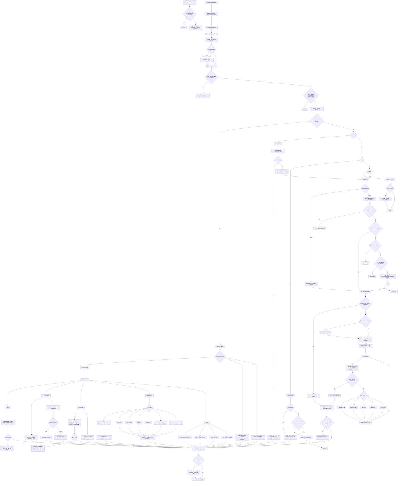
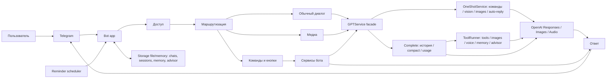
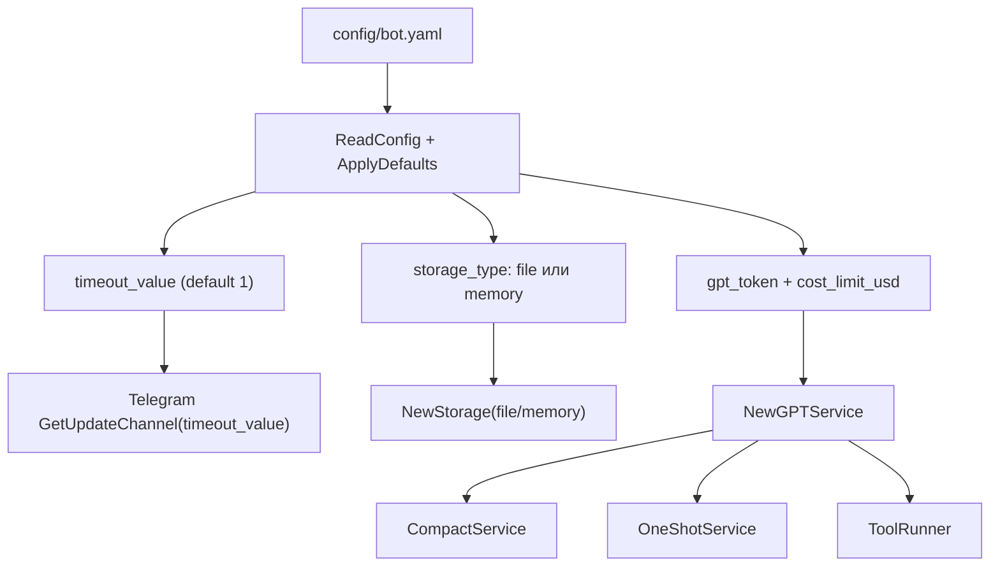
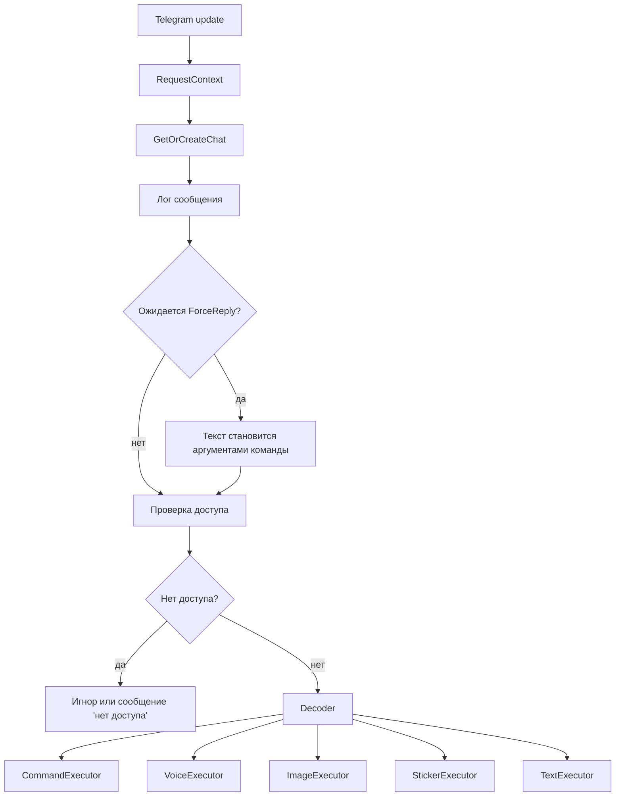
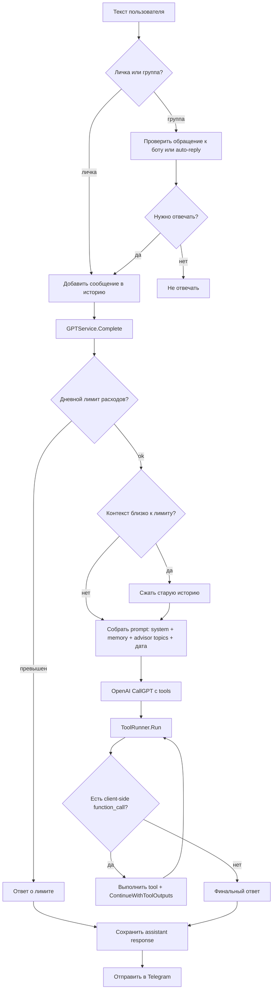
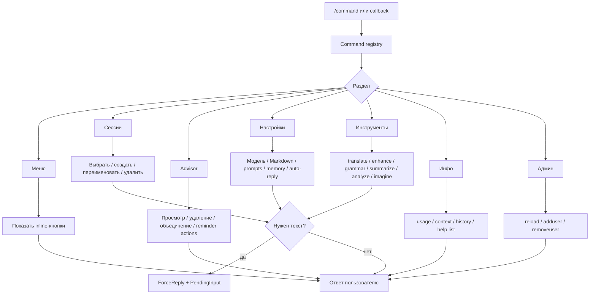
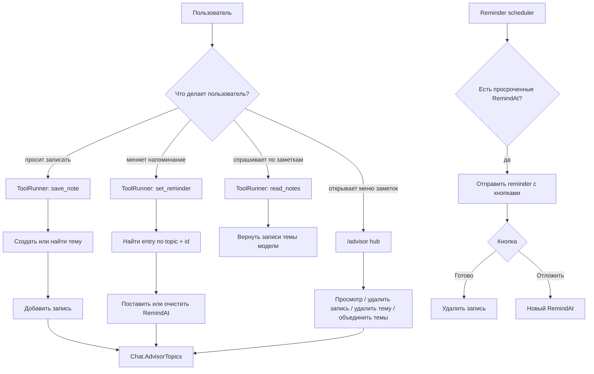
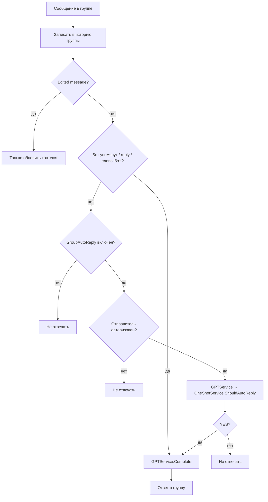
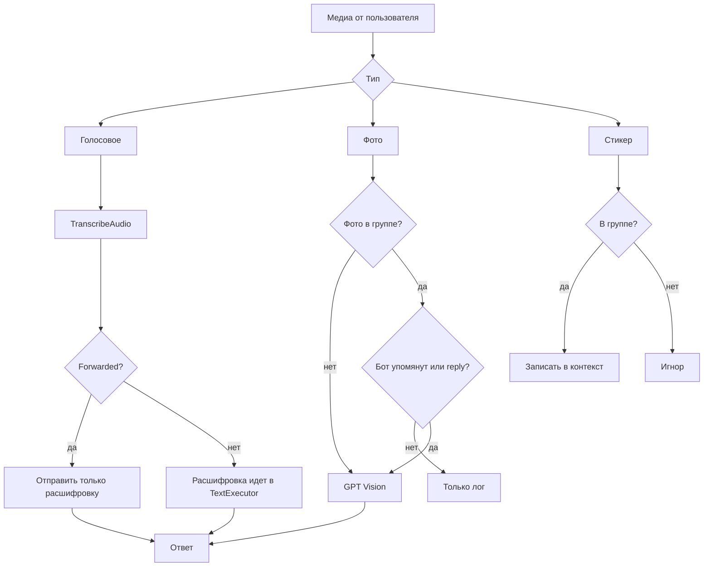

# Пользовательские процессы бота

## Общая верхнеуровневая схема

## Запуск и конфиг

## Вход, доступ и маршрутизация

## Обычный GPT-диалог

## Команды и кнопки

## Advisor-заметки и напоминания

## Групповой чат

## Медиа-сценарии

